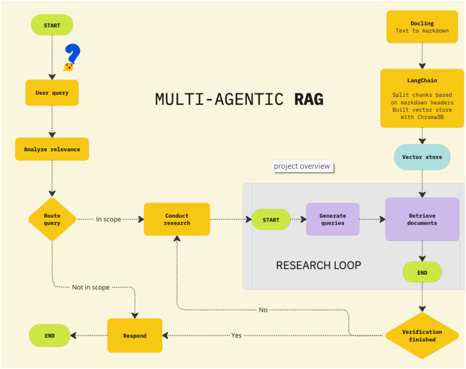

# RAG Chat — Multi-Agent RAG Chat System

**RAG Chat** is a multi-agent **Retrieval-Augmented Generation (RAG)** system designed to help you **ask questions about long, complex documents** and get **accurate, verified, hallucination-free answers**.  
It combines **LangGraph, Docling, ChromaDB, IBM watsonX AI, and Gradio** to deliver a powerful and user-friendly document analysis experience.

---

## Key Features

- Analyze complex documents (PDF, DOCX, TXT, Markdown)
- Return accurate, source-grounded answers
- Verify every answer with a fact-checking agent
- Hybrid Retrieval: BM25 (keyword-based) + vector search (semantic)
- Multi-Agent Workflow using LangGraph:
  - `RelevanceChecker` — checks if the question is in scope  
  - `ResearchAgent` — generates draft answers  
  - `VerificationAgent` — validates answers
- User-friendly Gradio interface with support for multiple documents

---

## System Architecture



---

## Try It Now (Demo Build)

You can download a **prebuilt demo version** to try RAG Chat instantly without setting up the environment.

**[Download RAG Chat Demo](test/test1.mp4)**


**How to run:**
1. Download the `.zip` file from the link above  
2. Extract it anywhere  
3. Run:
   ```
   python app.py
   ```
4. Open [http://127.0.0.1:5000](http://127.0.0.1:5000) in your browser

---

## Installation from Source

> Requires: Python 3.11+

### 1. Clone the repository

```
git clone https://github.com/quanho114/rag-multi-agent_chat.git
cd rag-multi-agent_chat
```
### 2. Create a virtual environment and install dependencies

```
python3.11 -m venv venv
source venv/bin/activate  # On Windows: venv\Scripts\activate
pip install -r requirements.txt
```
### 3. Launch the app
```
python app.py
```
---

## How to Use

1. Upload one or more documents (PDF, DOCX, TXT…)  
2. Enter your question  
3. Click **Submit** and the system will:
   - Parse and process the documents
   - Retrieve the most relevant chunks (BM25 + vector search)
   - Generate a draft answer
   - Verify factual correctness
   - Return the final verified answer and a verification report

You can also try the example documents inside the `examples/` folder.

---

## Project Structure
```
rag-multi-agent_chat/
│
├── app.py # Main entry point (Gradio UI + orchestrator)
├── agents/ # Agents: RelevanceChecker, ResearchAgent, VerificationAgent
├── builder.py # Hybrid retriever (BM25 + Vector Search)
├── file_handler.py # Document processing, chunking & caching
├── workflow.py # Multi-Agent Workflow with LangGraph
├── examples/ # Example documents
└── requirements.txt
```

---

## Future Improvements

- Try other embedding models (OpenAI, HuggingFace, etc.)  
- Improve retriever ranking logic and feedback loop  
- Add AI guardrails / safety mechanisms  
- Enhance UI with chat history and annotations  
- Deploy to cloud (Hugging Face Spaces, AWS, IBM Cloud)

---

## Authors

- **Project owner:** [quanho114](https://github.com/quanho114)  
- Original concept and implementation inspired by:  
  -Hailey Quach – Data Scientist @ IBM  
  - Ricky Shi  
  - Wojciech "Victor" Fulmyk – Data Scientist @ IBM, PhD candidate @ University of Calgary

---

## License

This project is licensed under the [MIT License](./LICENSE).
